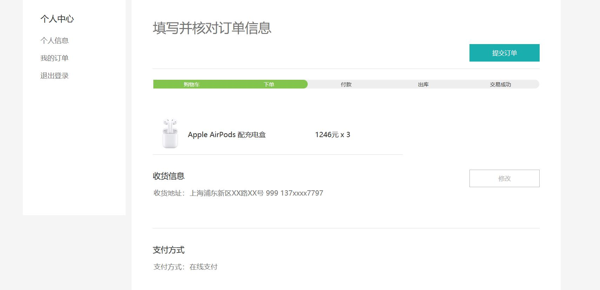

# 商城项目学习
## 数据库结构
|数据库名								|管理信息			|
|--										|--					|
|`tb_newbee_mall_admin_user`			|后台管理用户信息	|
|`tb_newbee_mall_carousel`				|轮播图信息			|
|`tb_newbee_mall_goods_category`		|产品分类信息		|
|`tb_newbee_mall_goods_info`			|具体产品信息		|
|`tb_newbee_mall_index_config`			|推荐产品信息		|
|`tb_newbee_mall_order`					|订单信息			|
|`tb_newbee_mall_order_item`			|具体订单信息		|
|`tb_newbee_mall_shopping_cart_item`	|用户购买记录信息	|
|`tb_newbee_mall_user`					|用户信息			|

### `tb_newbee_mall_admin_user` 

|Field				|Type					|Comment		|
|--					|--						|--				|
|admin_user_id		|int(11) NOT NULL		|管理员id		|
|login_user_name	|varchar(50) NOT NULL	|管理员登陆名称	|
|login_password		|varchar(50) NOT NULL	|管理员登陆密码	|
|nick_name			|varchar(50) NOT NULL	|管理员显示昵称	|
|	locked	|tinyint(4) NULL	|						|是否锁定 0未锁定 1已锁定无法登陆	|

### `tb_newbee_mall_carousel`

|Field			|Type					|Comment						|
|--				|--						|--								|
|carousel_id	|int(11) NOT NULL		|首页轮播图主键id				|
|carousel_url	|varchar(100) NOT NULL	|轮播图							|
|redirect_url	|varchar(100) NOT NULL	|点击后的跳转地址(默认不跳转)	|
|carousel_rank	|int(11) NOT NULL		|排序值(字段越大越靠前)			|
|	is_deleted	|	tinyint(4) NOT NULL	|	删除标识字段(0-未删除 1-已删除)	
|	create_time	|	timestamp NOT NULL	|	创建时间	|
|	create_user	|	int(11) NOT NULL	|	创建者id	|
|	update_time	|	timestamp NOT NULL	|	修改时间	|
|	update_user	|	int(11) NOT NULL	|	修改者id	|

### `tb_newbee_mall_goods_category`

|Field			|Type			|Comment									|
|--				|--				|--											|
|category_id	|bigint(20)		|分类id										|
|category_level	|tinyint(4)		|分类级别(1-一级分类 2-二级分类 3-三级分类)	|
|parent_id		|bigint(20)		|父分类id									|
|category_name	|varchar(50)	|分类名称									|
|category_rank	|int(11)		|排序值(字段越大越靠前)						|
|is_deleted		|tinyint(4)		|删除标识字段(0-未删除 1-已删除)			|
                                               
category_level示例：


### `tb_newbee_mall_index_config`
|	Field	|	Type	|	Comment	|                                                                                                         
|--|--|--|
|	config_id	|	bigint(20)	|	首页配置项主键id	|                                                                                         
|	config_name	|	varchar(50)	|	显示字符(配置搜索时不可为空，其他可为空)		|                                                     
|	config_type	|	tinyint(4)	|	1-搜索框热搜 2-搜索下拉框热搜 3-(首页)热销商品 4-(首页)新品上线 5-(首页)为你推荐	|  
|	goods_id	|	bigint(20)	|	商品id 默认为0	|
|	redirect_url	|	varchar(100)	|	点击后的跳转地址(默认不跳转)	|
|	config_rank	|	int(11)	|	排序值(字段越大越靠前)	|
|	is_deleted	|	tinyint(4)	|	删除标识字段(0-未删除 1-已删除)	|

### `tb_newbee_mall_order` 
|	Field	|	Type	|	Comment	|
|--|--|--|
|	order_id	|	bigint(20)	|	订单表主键id	|
|	order_no	|	varchar(20)	|	订单号	|
|	user_id	|	bigint(20)	|	用户主键id	|
|	total_price	|	int(11)	|	订单总价	|
|	pay_status	|	tinyint(4)	|	支付状态:0.未支付,1.支付成功,-1:支付失败	|
|	pay_type	|	tinyint(4)	|	0.无 1.支付宝支付 2.微信支付	|
|	pay_time	|	timestamp	|	支付时间	|
|	order_status	|	tinyint(4)	|	订单状态:0.待支付 1.已支付 2.配货完成 3:出库成功 4.交易成功 -1.手动关闭 -2.超时关闭 -3.商家关闭	|
|	extra_info	|	varchar(100)	|	订单信息	|
|	is_deleted	|	tinyint(4)	|	删除标识字段(0-未删除 1-已删除)	|

# 顾客系统
## 登陆
1.发送/login请求：
2.由ltd.newbee.mall.controller.mall.PersonalController处理请求：
```java
 @GetMapping({"/login", "login.html"})
    public String loginPage() {
        return "mall/login";
    }
```
3.来到登陆页面并以post方式发送/login请求：

4.由PersonalController处理post请求：
```java
 @PostMapping("/login")
    @ResponseBody
    public Result login(@RequestParam("loginName") String loginName,
                        @RequestParam("verifyCode") String verifyCode,
                        @RequestParam("password") String password,
                        HttpSession httpSession) {
        if (StringUtils.isEmpty(loginName)) {
            return ResultGenerator.genFailResult(ServiceResultEnum.LOGIN_NAME_NULL.getResult());
        }
        if (StringUtils.isEmpty(password)) {
            return ResultGenerator.genFailResult(ServiceResultEnum.LOGIN_PASSWORD_NULL.getResult());
        }
        if (StringUtils.isEmpty(verifyCode)) {
            return ResultGenerator.genFailResult(ServiceResultEnum.LOGIN_VERIFY_CODE_NULL.getResult());
        }
        String kaptchaCode = httpSession.getAttribute(Constants.MALL_VERIFY_CODE_KEY) + "";
		//对验证码进行忽略大小写处理
        if (StringUtils.isEmpty(kaptchaCode) || !verifyCode.toLowerCase().equals(kaptchaCode)) {
            return ResultGenerator.genFailResult(ServiceResultEnum.LOGIN_VERIFY_CODE_ERROR.getResult());
        }
        String loginResult = newBeeMallUserService.login(loginName, password, httpSession);
        //登录成功
        if (ServiceResultEnum.SUCCESS.getResult().equals(loginResult)) {
            //删除session中的verifyCode
            httpSession.removeAttribute(Constants.MALL_VERIFY_CODE_KEY);
            return ResultGenerator.genSuccessResult();
        }
        //登录失败
        return ResultGenerator.genFailResult(loginResult);
    }
```
成功返回json字符串并发送"/"请求由同级包下的indexController进行处理：
```java
 @GetMapping({"/index", "/", "/index.html"})
    public String indexPage(HttpServletRequest request) {
        List<NewBeeMallIndexCategoryVO> categories = newBeeMallCategoryService.getCategoriesForIndex();
        if (CollectionUtils.isEmpty(categories)) {
            return "error/error_5xx";
        }
        List<NewBeeMallIndexCarouselVO> carousels = newBeeMallCarouselService.getCarouselsForIndex(Constants.INDEX_CAROUSEL_NUMBER);
        List<NewBeeMallIndexConfigGoodsVO> hotGoodses = newBeeMallIndexConfigService.getConfigGoodsesForIndex(IndexConfigTypeEnum.INDEX_GOODS_HOT.getType(), Constants.INDEX_GOODS_HOT_NUMBER);
        List<NewBeeMallIndexConfigGoodsVO> newGoodses = newBeeMallIndexConfigService.getConfigGoodsesForIndex(IndexConfigTypeEnum.INDEX_GOODS_NEW.getType(), Constants.INDEX_GOODS_NEW_NUMBER);
        List<NewBeeMallIndexConfigGoodsVO> recommendGoodses = newBeeMallIndexConfigService.getConfigGoodsesForIndex(IndexConfigTypeEnum.INDEX_GOODS_RECOMMOND.getType(), Constants.INDEX_GOODS_RECOMMOND_NUMBER);
        request.setAttribute("categories", categories);//分类数据
        request.setAttribute("carousels", carousels);//轮播图
        request.setAttribute("hotGoodses", hotGoodses);//热销商品
        request.setAttribute("newGoodses", newGoodses);//新品
        request.setAttribute("recommendGoodses", recommendGoodses);//推荐商品
        return "mall/index";
    }
```
进入商城主页。
## 商城主页
1.布局：


### 边栏查看商品分类
1.search.html发送/search请求:
```html
<div class="classify">
    <div class="category">
        <div class="category_bar">
            <th:block th:if="${searchPageCategoryVO!=null}">
                <div class="fm c">
                    <a href="##" class="qqq" th:text="${searchPageCategoryVO.secondLevelCategoryName}">newbee-mall</a>
                    <div>
                        <th:block th:each="thirdLevelCategory : ${searchPageCategoryVO.thirdLevelCategoryList}">
                            <a th:href="@{${'/search?goodsCategoryId='+thirdLevelCategory.categoryId}}"
                               th:text="${thirdLevelCategory.categoryName}">newbee-mall</a>
							   <!-- 发送 /search请求并携带对应商品id-->
                        </th:block>
                    </div>
                </div>
                <i></i>
                <div class="findword">"
                    <th:block th:text="${searchPageCategoryVO.currentCategoryName}"></th:block>
                    "
                </div>
            </th:block>
        </div>
    </div>
</div>
```
2.由GoodsController处理请求
```java
 @GetMapping({"/search", "/search.html"})
    public String searchPage(@RequestParam Map<String, Object> params, HttpServletRequest request) {
        if (StringUtils.isEmpty(params.get("page"))) {
            params.put("page", 1);
        }
        params.put("limit", Constants.GOODS_SEARCH_PAGE_LIMIT);
        //封装分类数据
        if (params.containsKey("goodsCategoryId") && !StringUtils.isEmpty(params.get("goodsCategoryId") + "")) {
            Long categoryId = Long.valueOf(params.get("goodsCategoryId") + "");
            SearchPageCategoryVO searchPageCategoryVO = newBeeMallCategoryService.getCategoriesForSearch(categoryId);
            if (searchPageCategoryVO != null) {
                request.setAttribute("goodsCategoryId", categoryId);
                request.setAttribute("searchPageCategoryVO", searchPageCategoryVO);
            }
        }
        //封装参数供前端回显
        if (params.containsKey("orderBy") && !StringUtils.isEmpty(params.get("orderBy") + "")) {
            request.setAttribute("orderBy", params.get("orderBy") + "");
        }
        String keyword = "";
        //对keyword做过滤 去掉空格
        if (params.containsKey("keyword") && !StringUtils.isEmpty((params.get("keyword") + "").trim())) {
            keyword = params.get("keyword") + "";
        }
        request.setAttribute("keyword", keyword);
        params.put("keyword", keyword);
        //搜索上架状态下的商品
        params.put("goodsSellStatus", Constants.SELL_STATUS_UP);
        //封装商品数据
        PageQueryUtil pageUtil = new PageQueryUtil(params);
        request.setAttribute("pageResult", newBeeMallGoodsService.searchNewBeeMallGoods(pageUtil));
        return "mall/search";
    }
	```
3.返回search.html回显数据：
```html
<!--排序-->
<div class="sort">
    <div class="list">
        <a th:href="@{'/search?keyword='+${keyword==null?'':keyword}+'&goodsCategoryId='+${goodsCategoryId==null?'':goodsCategoryId}+'&orderBy=default'}">
            <div th:class="${orderBy==null || orderBy=='default'?'active':''}">推荐</div>
        </a>
        <a th:href="@{'/search?keyword='+${keyword==null?'':keyword}+'&goodsCategoryId='+${goodsCategoryId==null?'':goodsCategoryId}+'&orderBy=new'}">
            <div th:class="${orderBy=='new'?'active':''}">新品</div>
        </a>
        <a th:href="@{'/search?keyword='+${keyword==null?'':keyword}+'&goodsCategoryId='+${goodsCategoryId==null?'':goodsCategoryId}+'&orderBy=price'}">
            <div th:class="${orderBy=='price'?'active':''}">价格</div>
        </a>
    </div>
</div>
<!-- 数据显示 -->
<div class="goods_item center">
    <div class="main center">
        <th:block th:if="${#lists.isEmpty(pageResult.list)}">
            
        </th:block>
        <th:block th:unless="${#lists.isEmpty(pageResult.list)}">
            <th:block th:each="goods : ${pageResult.list}">
                <div class="item_card_frame">
                    <div class="item_card"><a th:href="@{'/goods/detail/'+${goods.goodsId}}" target="_blank"></a></div>
                    <div class="item_brand"><a th:href="@{'/goods/detail/'+${goods.goodsId}}" target="_blank"
                                               th:text="${goods.goodsName}">newbee.ltd</a></div>
                    <div class="item_sub_intro" th:text="${goods.goodsIntro}">newbee.ltd</div>
                    <div class="item_price" th:text="${goods.sellingPrice+'.00元'}">1299.00元</div>
                </div>
            </th:block>
        </th:block>
        <div class="clear"></div>
    </div>
   
    </div>
</div>
```
### 首页点击商品图片
点击发送/goods/detail/{goodsid}请求
1.首先拦截器判断是否登录：
```java
@Component
public class NewBeeMallLoginInterceptor implements HandlerInterceptor {

//检查session
    @Override
    public boolean preHandle(HttpServletRequest request, HttpServletResponse response, Object o) throws Exception {
        if (null == request.getSession().getAttribute(Constants.MALL_USER_SESSION_KEY)) {
			//session不存在，作跳转登录页面处理
            response.sendRedirect(request.getContextPath() + "/login");
            return false;
        } else {
			//放行
            return true;
        }
    }

    @Override
    public void postHandle(HttpServletRequest httpServletRequest, HttpServletResponse httpServletResponse, Object o, ModelAndView modelAndView) throws Exception {
    }

    @Override
    public void afterCompletion(HttpServletRequest httpServletRequest, HttpServletResponse httpServletResponse, Object o, Exception e) throws Exception {

    }
}
```
2.由GoodsController处理请求：
```java
   @GetMapping("/goods/detail/{goodsId}")
    public String detailPage(@PathVariable("goodsId") Long goodsId, HttpServletRequest request) {
        if (goodsId < 1) {
            return "error/error_5xx";
        }
        NewBeeMallGoods goods = newBeeMallGoodsService.getNewBeeMallGoodsById(goodsId);
        if (goods == null) {
            NewBeeMallException.fail(ServiceResultEnum.GOODS_NOT_EXIST.getResult());
        }
        if (Constants.SELL_STATUS_UP != goods.getGoodsSellStatus()) {
            NewBeeMallException.fail(ServiceResultEnum.GOODS_PUT_DOWN.getResult());
        }
        NewBeeMallGoodsDetailVO goodsDetailVO = new NewBeeMallGoodsDetailVO();
        BeanUtil.copyProperties(goods, goodsDetailVO);
        goodsDetailVO.setGoodsCarouselList(goods.getGoodsCarousel().split(","));
        request.setAttribute("goodsDetail", goodsDetailVO);
        return "mall/detail";
    }
```
3.跳转至detail.html页面回显数据

## 商品详情页立即购买和加入购物车处理流程
效果图：

### 加入购物车ajax实现
1.发送/shop-cart post请求
```JavaScript

     /**
     * 添加到购物车
     */
    function saveToCart(id) {
        var goodsCount = 1;
        var data = {
            "goodsId": id,
            "goodsCount": goodsCount
        };
        $.ajax({
            type: 'POST',
            url: '/shop-cart',
            contentType: 'application/json',
            data: JSON.stringify(data),
            success: function (result) {
                if (result.resultCode == 200) {
                    swal({
                        title: "添加成功",
                        text: "确认框",
                        icon: "success",
                        buttons: true,
                        dangerMode: true,
                    }).then((flag) => {
                            window.location.reload();
                        }
                    );
                } else {
                    swal(result.message, {
                        icon: "error",
                    });
                }
            },
            error: function () {
                swal("操作失败", {
                    icon: "error",
                });
            }
        });
    }

```
2.由ShoppingCartController处理请求：
```java
 @PostMapping("/shop-cart")
    @ResponseBody
    public Result saveNewBeeMallShoppingCartItem(@RequestBody NewBeeMallShoppingCartItem newBeeMallShoppingCartItem,
                                                 HttpSession httpSession) {
		//根据session获取用户
        NewBeeMallUserVO user = (NewBeeMallUserVO) httpSession.getAttribute(Constants.MALL_USER_SESSION_KEY);
		
        newBeeMallShoppingCartItem.setUserId(user.getUserId());
        String saveResult = newBeeMallShoppingCartService.saveNewBeeMallCartItem(newBeeMallShoppingCartItem);
        //添加成功
        if (ServiceResultEnum.SUCCESS.getResult().equals(saveResult)) {
            return ResultGenerator.genSuccessResult();
        }
        //添加失败
        return ResultGenerator.genFailResult(saveResult);
    }
```
### 立即购买实现
```JavaScript
  /**
     * 添加到购物车并跳转至购物车页面
     */
    function saveAndGoCart(id) {
        var goodsCount = 1;
        var data = {
            "goodsId": id,
            "goodsCount": goodsCount
        };
        $.ajax({
            type: 'POST',
            url: '/shop-cart',
            contentType: 'application/json',
            data: JSON.stringify(data),
            success: function (result) {
                if (result.resultCode == 200) {
                    swal({
                        title: "已将商品加入购物车",
                        icon: "success",
                        buttons: {
                            cancel: "留在当前页",
                            confirm: "去购物车结算"
                        },
                        dangerMode: false,
                    }).then((flag) => {
                            if (flag) {
                                window.location.href = '/shop-cart';
                            }
                        }
                    );
                } else {
                    swal(result.message, {
                        icon: "error",
                    });
                }
            },
            error: function () {
                swal("操作失败", {
                    icon: "error",
                });
            }
        });
    }
```
比加入购物车多一步确认跳转实现
2.确认跳转后发送/shop-cart 的get请求由ShoppingCartController处理：
```java
 @GetMapping("/shop-cart")
    public String cartListPage(HttpServletRequest request,
                               HttpSession httpSession) {
        NewBeeMallUserVO user = (NewBeeMallUserVO) httpSession.getAttribute(Constants.MALL_USER_SESSION_KEY);
        int itemsTotal = 0;
        int priceTotal = 0;
        List<NewBeeMallShoppingCartItemVO> myShoppingCartItems = newBeeMallShoppingCartService.getMyShoppingCartItems(user.getUserId());
        if (!CollectionUtils.isEmpty(myShoppingCartItems)) {
            //购物项总数
            itemsTotal = myShoppingCartItems.stream().mapToInt(NewBeeMallShoppingCartItemVO::getGoodsCount).sum();
            if (itemsTotal < 1) {
                return "error/error_5xx";
            }
            //总价
            for (NewBeeMallShoppingCartItemVO newBeeMallShoppingCartItemVO : myShoppingCartItems) {
                priceTotal += newBeeMallShoppingCartItemVO.getGoodsCount() * newBeeMallShoppingCartItemVO.getSellingPrice();
            }
            if (priceTotal < 1) {
                return "error/error_5xx";
            }
        }
        request.setAttribute("itemsTotal", itemsTotal);
        request.setAttribute("priceTotal", priceTotal);
        request.setAttribute("myShoppingCartItems", myShoppingCartItems);
        return "mall/cart";
    }
```
### 跳转购物车页面：
1.点击右上角的购物车或直接结算同上发送/shop-cart 的get请求

2.购物车页面：

#### 购买商品数量更新：
1.改变数量框位置：cart.html
```html
<input class="goods_count" th:id="${'goodsCount'+item.cartItemId}" type="number"
 th:value="${item.goodsCount}"
 th:onclick="'updateItem('+${item.cartItemId}+')'"
 step="1" min="1"
 max="10"/>
 ```
2.改变数量后触发updateItem(id)方法：
```JavaScript
 /**
     *更新购物项
     */
    function updateItem(id) {
        var domId = 'goodsCount' + id;
        var goodsCount = $("#" + domId).val();
        // alert(goodsCount);
        if (goodsCount > 10) {
            swal("单个商品最多可购买10个", {
                icon: "error",
            });
            return;
        }
        if (goodsCount < 1) {
            swal("数量异常", {
                icon: "error",
            });
            return;
        }
        var data = {
            "cartItemId": id,
            "goodsCount": goodsCount
        };
        $.ajax({
            type: 'PUT',
            url: '/shop-cart',
            contentType: 'application/json',
            data: JSON.stringify(data),
            success: function (result) {
                if (result.resultCode == 200) {
                    window.location.reload();
                } else {
                    swal("操作失败", {
                        icon: "error",
                    });
                }
            },
            error: function () {
                swal("操作失败", {
                    icon: "error",
                });
            }
        });
    }
```
3.ShoppingCartController处理/shop-cart的put请求：
```java
@PutMapping("/shop-cart")
    @ResponseBody
    public Result updateNewBeeMallShoppingCartItem(@RequestBody NewBeeMallShoppingCartItem newBeeMallShoppingCartItem,
                                                   HttpSession httpSession) {
        NewBeeMallUserVO user = (NewBeeMallUserVO) httpSession.getAttribute(Constants.MALL_USER_SESSION_KEY);
        newBeeMallShoppingCartItem.setUserId(user.getUserId());
        String updateResult = newBeeMallShoppingCartService.updateNewBeeMallCartItem(newBeeMallShoppingCartItem);
        //修改成功
        if (ServiceResultEnum.SUCCESS.getResult().equals(updateResult)) {
            return ResultGenerator.genSuccessResult();
        }
        //修改失败
        return ResultGenerator.genFailResult(updateResult);
    }
```
4.页面自动刷新

### 跳转结算页面：
1.cart.html点击结算：
```html
 <th:block th:unless="${itemsTotal == 0}">
<input class="order_button_d" type="button" name="settle"
onclick="settle()"
value="去结算"/>
</th:block>
```
```JavaScript
/**
     * 跳转至结算页面
     */
    function settle() {
        window.location.href = '/shop-cart/settle'
    }

```
2.ShoppingCartController处理请求：
```java
 @GetMapping("/shop-cart/settle")
    public String settlePage(HttpServletRequest request,
                             HttpSession httpSession) {
        int priceTotal = 0;
        NewBeeMallUserVO user = (NewBeeMallUserVO) httpSession.getAttribute(Constants.MALL_USER_SESSION_KEY);
        List<NewBeeMallShoppingCartItemVO> myShoppingCartItems = newBeeMallShoppingCartService.getMyShoppingCartItems(user.getUserId());
        if (CollectionUtils.isEmpty(myShoppingCartItems)) {
            //无数据则不跳转至结算页
            return "/shop-cart";
        } else {
            //总价
            for (NewBeeMallShoppingCartItemVO newBeeMallShoppingCartItemVO : myShoppingCartItems) {
                priceTotal += newBeeMallShoppingCartItemVO.getGoodsCount() * newBeeMallShoppingCartItemVO.getSellingPrice();
            }
            if (priceTotal < 1) {
                return "error/error_5xx";
            }
        }
        request.setAttribute("priceTotal", priceTotal);
        request.setAttribute("myShoppingCartItems", myShoppingCartItems);
        return "mall/order-settle";
    }
```
3.携带数据跳转至order-settle.html页面

#### 修改地址
1.点击修改按钮跳出修改模态框：
```html
  <div class="actions">
  <a class="btn btn-small btn-line-gray J_editAddr"
  href="javascript:openUpdateModal();">修改</a>
  </div>
```
2.修改后点击保存：
```javascript
 //绑定modal上的保存按钮
    $('#saveButton').click(function () {
        var address = $("#address").val();
        var userId = $("#userId").val();
        var data = {
            "userId": userId,
            "address": address
        };
        $.ajax({
            type: 'POST',//方法类型
            url: '/personal/updateInfo',
            contentType: 'application/json',
            data: JSON.stringify(data),
            success: function (result) {
                if (result.resultCode == 200) {
                    $('#personalInfoModal').modal('hide');
                    window.location.reload();
                } else {
                    $('#personalInfoModal').modal('hide');
                    swal(result.message, {
                        icon: "error",
                    });
                }
                ;
            },
            error: function () {
                swal('操作失败', {
                    icon: "error",
                });
            }
        });
    });
```
3.PersonalController处理 /personal/updateInfo 的post提交请求：
```java
@PostMapping("/personal/updateInfo")
    @ResponseBody
    public Result updateInfo(@RequestBody MallUser mallUser, HttpSession httpSession) {
        NewBeeMallUserVO mallUserTemp = newBeeMallUserService.updateUserInfo(mallUser, httpSession);
        if (mallUserTemp == null) {
            Result result = ResultGenerator.genFailResult("修改失败");
            return result;
        } else {
            //返回成功
            Result result = ResultGenerator.genSuccessResult();
            return result;
        }
    }
```
4.返回修改结果
#### 订单提交
1.点击提交按钮发送saveOrder请求：
```html
 <div class="actions">
  <a id="saveOrder" class="btn btn-small btn-primary" title="提交订单">提交订单</a>
  </div>
```
```JavaScript
$('#saveOrder').click(function () {
        var userAddress = $(".user_address_label").html();
        if (userAddress == '' || userAddress == '无') {
            swal("请填写收货信息", {
                icon: "error",
            });
            return;
        }
        if (userAddress.trim().length < 10) {
            swal("请输入正确的收货信息", {
                icon: "error",
            });
            return;
        }
        window.location.href = '../saveOrder';
    });
```
2.OrderController处理请求：
```java
 @GetMapping("/saveOrder")
    public String saveOrder(HttpSession httpSession) {
        NewBeeMallUserVO user = (NewBeeMallUserVO) httpSession.getAttribute(Constants.MALL_USER_SESSION_KEY);
        List<NewBeeMallShoppingCartItemVO> myShoppingCartItems = newBeeMallShoppingCartService.getMyShoppingCartItems(user.getUserId());
        if (StringUtils.isEmpty(user.getAddress().trim())) {
            //无收货地址
            NewBeeMallException.fail(ServiceResultEnum.NULL_ADDRESS_ERROR.getResult());
        }
        if (CollectionUtils.isEmpty(myShoppingCartItems)) {
            //购物车中无数据则跳转至错误页
            NewBeeMallException.fail(ServiceResultEnum.SHOPPING_ITEM_ERROR.getResult());
        }
        //保存订单并返回订单号
        String saveOrderResult = newBeeMallOrderService.saveOrder(user, myShoppingCartItems);
        //跳转到订单详情页
        return "redirect:/orders/" + saveOrderResult;
    }
```
3.转发/orders/订单号 请求：
```java
  @GetMapping("/orders/{orderNo}")
    public String orderDetailPage(HttpServletRequest request, @PathVariable("orderNo") String orderNo, HttpSession httpSession) {
        NewBeeMallUserVO user = (NewBeeMallUserVO) httpSession.getAttribute(Constants.MALL_USER_SESSION_KEY);
        NewBeeMallOrderDetailVO orderDetailVO = newBeeMallOrderService.getOrderDetailByOrderNo(orderNo, user.getUserId());
        if (orderDetailVO == null) {
            return "error/error_5xx";
        }
        request.setAttribute("orderDetailVO", orderDetailVO);
        return "mall/order-detail";
    }
```
4.跳转至order-detail.html页面
### 跳转支付页面：
order-detail.html对订单状态进行判断：
```html
							<div class="actions">
                                <input type="hidden" id="orderNoValue" th:value="${orderDetailVO.orderNo}">
								<!-- 处于已支付状态 -->
                                <th:block th:if="${orderDetailVO.orderStatus>0 and orderDetailVO.orderStatus<3}">
                                    <a onclick="cancelOrder()"
                                       class="btn btn-small btn-line-gray" title="取消订单">取消订单</a>
                                </th:block>
                                <th:block th:if="${orderDetailVO.orderStatus==0}">
								<!-- 未支付状态 -->
                                    <a onclick="payOrder()"
                                       class="btn btn-small btn-primary" title="去支付">去支付</a>
                                </th:block>
								<!-- 发货状态 -->
                                <th:block th:if="${orderDetailVO.orderStatus==3}">
                                    <a onclick="finishOrder()"
                                       class="btn btn-small btn-primary" title="确认收货">确认收货</a>
                                </th:block>
                            </div>
```
#### 支付
1.点击支付按钮触发payOrder事件：
```javascript
 function payOrder() {
        var orderNo = $("#orderNoValue").val();
        window.location.href = '/selectPayType?orderNo=' + orderNo;
    }
```
2.OrderController处理请求：
```java
  @GetMapping("/selectPayType")
    public String selectPayType(HttpServletRequest request, @RequestParam("orderNo") String orderNo, HttpSession httpSession) {
        NewBeeMallUserVO user = (NewBeeMallUserVO) httpSession.getAttribute(Constants.MALL_USER_SESSION_KEY);
        NewBeeMallOrder newBeeMallOrder = newBeeMallOrderService.getNewBeeMallOrderByOrderNo(orderNo);
        //判断订单userId
        if (!user.getUserId().equals(newBeeMallOrder.getUserId())) {
            NewBeeMallException.fail(ServiceResultEnum.NO_PERMISSION_ERROR.getResult());
        }
        //判断订单状态
        if (newBeeMallOrder.getOrderStatus().intValue() != NewBeeMallOrderStatusEnum.ORDER_PRE_PAY.getOrderStatus()) {
            NewBeeMallException.fail(ServiceResultEnum.ORDER_STATUS_ERROR.getResult());
        }
        request.setAttribute("orderNo", orderNo);
        request.setAttribute("totalPrice", newBeeMallOrder.getTotalPrice());
        return "mall/pay-select";
    } 
```
3.成功跳转到pay-select.html页面

4.选择支付方式，执行payOrder方法携带订单号和支付方式
```javascript
 function payOrder(payType) {
        var orderNo = $("#orderNoValue").val();
        window.location.href = '/payPage?orderNo=' + orderNo + "&payType=" + payType;
    }
```
5.OrderController处理/payPage请求，并根据不同支付方式跳转不同支付页面（支付宝和微信）
```java
 @GetMapping("/payPage")
    public String payOrder(HttpServletRequest request, @RequestParam("orderNo") String orderNo, HttpSession httpSession, @RequestParam("payType") int payType) {
        NewBeeMallUserVO user = (NewBeeMallUserVO) httpSession.getAttribute(Constants.MALL_USER_SESSION_KEY);
        NewBeeMallOrder newBeeMallOrder = newBeeMallOrderService.getNewBeeMallOrderByOrderNo(orderNo);
        //判断订单userId
        if (!user.getUserId().equals(newBeeMallOrder.getUserId())) {
            NewBeeMallException.fail(ServiceResultEnum.NO_PERMISSION_ERROR.getResult());
        }
        //判断订单状态
        if (newBeeMallOrder.getOrderStatus().intValue() != NewBeeMallOrderStatusEnum.ORDER_PRE_PAY.getOrderStatus()) {
            NewBeeMallException.fail(ServiceResultEnum.ORDER_STATUS_ERROR.getResult());
        }
        request.setAttribute("orderNo", orderNo);
        request.setAttribute("totalPrice", newBeeMallOrder.getTotalPrice());
        if (payType == 1) {
            return "mall/alipay";
        } else {
            return "mall/wxpay";
        }
    }
```
6.跳转到对应页面后点击支付成功按钮触发payOrderSuccess事件
```html
<div class="tip-text">
                <a onclick="payOrderSuccess()"
                   class="btn btn-small btn-success" title="支付成功">支付成功</a>
            </div>
```
```javascript
 function payOrderSuccess() {
        var orderNo = $("#orderNoValue").val();
        $.ajax({
            type: 'GET',
            url: '/paySuccess?payType=1&orderNo=' + orderNo,
            success: function (result) {
                if (result.resultCode == 200) {
                    window.location.href = '/orders/' + orderNo;
                } else {
                    alert(result.message);
                }
            },
            error: function () {
                alert("操作失败");
            }
        });
    }
```
7.返回订单类表等待后台确认：
```java
 @GetMapping("/orders")
    public String orderListPage(@RequestParam Map<String, Object> params, HttpServletRequest request, HttpSession httpSession) {
        NewBeeMallUserVO user = (NewBeeMallUserVO) httpSession.getAttribute(Constants.MALL_USER_SESSION_KEY);
        params.put("userId", user.getUserId());
        if (StringUtils.isEmpty(params.get("page"))) {
            params.put("page", 1);
        }
        params.put("limit", Constants.ORDER_SEARCH_PAGE_LIMIT);
        //封装我的订单数据
        PageQueryUtil pageUtil = new PageQueryUtil(params);
        request.setAttribute("orderPageResult", newBeeMallOrderService.getMyOrders(pageUtil));
        request.setAttribute("path", "orders");
        return "mall/my-orders";
    }
```

# 后台管理员系统
## 登陆
1. 发送/admin/login get请求来到登录页面

2. 点击登陆发送/admin/login post请求由AdminController处理请求重定向至/admin/index后台首页：
```java
   @GetMapping({"", "/", "/index", "/index.html"})
    public String index(HttpServletRequest request) {
        request.setAttribute("path", "index");
        return "admin/index";
    }

    @PostMapping(value = "/login")
    public String login(@RequestParam("userName") String userName,
                        @RequestParam("password") String password,
                        @RequestParam("verifyCode") String verifyCode,
                        HttpSession session) {
        if (StringUtils.isEmpty(verifyCode)) {
            session.setAttribute("errorMsg", "验证码不能为空");
            return "admin/login";
        }
        if (StringUtils.isEmpty(userName) || StringUtils.isEmpty(password)) {
            session.setAttribute("errorMsg", "用户名或密码不能为空");
            return "admin/login";
        }
        String kaptchaCode = session.getAttribute("verifyCode") + "";
        if (StringUtils.isEmpty(kaptchaCode) || !verifyCode.equals(kaptchaCode)) {
            System.out.println(verifyCode+"  "+kaptchaCode);
            System.out.println("====================");
            session.setAttribute("errorMsg", "验证码错误");
            return "admin/login";
        }
        AdminUser adminUser =null;

        adminUser=adminUserService.login(userName, password);
        System.out.println(userName+"  "+password);

if(adminUser!=null) System.out.println(adminUser.toString());
        if (adminUser != null) {
            session.setAttribute("loginUser", adminUser.getNickName());
            session.setAttribute("loginUserId", adminUser.getAdminUserId());
            //session过期时间设置为7200秒 即两小时
            //session.setMaxInactiveInterval(60 * 60 * 2);
            return "redirect:/admin/index";
        } else {
            session.setAttribute("errorMsg", "登录失败");
            return "admin/login";
        }

    }
```
首页：

### 新增商品信息
1.  发送/admin/goods/edit get请求由NewBeeMallGoodsController处理:
```java
 @GetMapping("/goods/edit")
    public String edit(HttpServletRequest request) {
        request.setAttribute("path", "edit");
        //查询所有的一级分类
        List<GoodsCategory> firstLevelCategories = newBeeMallCategoryService.selectByLevelAndParentIdsAndNumber(Collections.singletonList(0L), NewBeeMallCategoryLevelEnum.LEVEL_ONE.getLevel());
        if (!CollectionUtils.isEmpty(firstLevelCategories)) {
            //查询一级分类列表中第一个实体的所有二级分类
            List<GoodsCategory> secondLevelCategories = newBeeMallCategoryService.selectByLevelAndParentIdsAndNumber(Collections.singletonList(firstLevelCategories.get(0).getCategoryId()), NewBeeMallCategoryLevelEnum.LEVEL_TWO.getLevel());
            if (!CollectionUtils.isEmpty(secondLevelCategories)) {
                //查询二级分类列表中第一个实体的所有三级分类
                List<GoodsCategory> thirdLevelCategories = newBeeMallCategoryService.selectByLevelAndParentIdsAndNumber(Collections.singletonList(secondLevelCategories.get(0).getCategoryId()), NewBeeMallCategoryLevelEnum.LEVEL_THREE.getLevel());
                request.setAttribute("firstLevelCategories", firstLevelCategories);
                request.setAttribute("secondLevelCategories", secondLevelCategories);
                request.setAttribute("thirdLevelCategories", thirdLevelCategories);
                request.setAttribute("path", "goods-edit");
                return "admin/newbee_mall_goods_edit";
            }
        }
        return "error/error_5xx";
    }
```
2. 查询所有的商品分类加入request中跳转newbee_mall_goods_edit.html页面

3. 点击保存发送/goods/save的post请求，由NewBeeMallGoodsController处理：
```java

    /**
     * 添加
     */
    @RequestMapping(value = "/goods/save", method = RequestMethod.POST)
    @ResponseBody
    public Result save(@RequestBody NewBeeMallGoods newBeeMallGoods) {
        if (StringUtils.isEmpty(newBeeMallGoods.getGoodsName())
                || StringUtils.isEmpty(newBeeMallGoods.getGoodsIntro())
                || StringUtils.isEmpty(newBeeMallGoods.getTag())
                || Objects.isNull(newBeeMallGoods.getOriginalPrice())
                || Objects.isNull(newBeeMallGoods.getGoodsCategoryId())
                || Objects.isNull(newBeeMallGoods.getSellingPrice())
                || Objects.isNull(newBeeMallGoods.getStockNum())
                || Objects.isNull(newBeeMallGoods.getGoodsSellStatus())
                || StringUtils.isEmpty(newBeeMallGoods.getGoodsCoverImg())
                || StringUtils.isEmpty(newBeeMallGoods.getGoodsDetailContent())) {
            return ResultGenerator.genFailResult("参数异常！");
        }
        String result = newBeeMallGoodsService.saveNewBeeMallGoods(newBeeMallGoods);
        if (ServiceResultEnum.SUCCESS.getResult().equals(result)) {
            return ResultGenerator.genSuccessResult();
        } else {
            return ResultGenerator.genFailResult(result);
        }
    }
```
4. 返回当前页面

### 获取列表信息-首页配置模块
1. newbee_mall_index_config.html table信息47行：
```html
 <table id="jqGrid" class="table table-bordered">
                        </table>
                        <div id="jqGridPager"></div>
```
未发送请求前效果：

2. 由static/admin/dist/js/newbee_mall_index_config.js 获取对应table id进行处理：
```js
$(function () {
    var configType = $("#configType").val();

    $("#jqGrid").jqGrid({
        url: '/admin/indexConfigs/list?configType=' + configType,
        datatype: "json",
        colModel: [
            {label: 'id', name: 'configId', index: 'configId', width: 50, key: true, hidden: true},
            {label: '配置项名称', name: 'configName', index: 'configName', width: 180},
            {label: '跳转链接', name: 'redirectUrl', index: 'redirectUrl', width: 120},
            {label: '排序值', name: 'configRank', index: 'configRank', width: 120},
            {label: '商品编号', name: 'goodsId', index: 'goodsId', width: 120},
            {label: '添加时间', name: 'createTime', index: 'createTime', width: 120}
        ],
        height: 560,
        rowNum: 10,
        rowList: [10, 20, 50],
        styleUI: 'Bootstrap',
        loadtext: '信息读取中...',
        rownumbers: false,
        rownumWidth: 20,
        autowidth: true,
        multiselect: true,
        pager: "#jqGridPager",
        jsonReader: {
            root: "data.list",
            page: "data.currPage",
            total: "data.totalPage",
            records: "data.totalCount"
        },
        prmNames: {
            page: "page",
            rows: "limit",
            order: "order",
        },
        gridComplete: function () {
            //隐藏grid底部滚动条
            $("#jqGrid").closest(".ui-jqgrid-bdiv").css({"overflow-x": "hidden"});
        }
    });

    $(window).resize(function () {
        $("#jqGrid").setGridWidth($(".card-body").width());
    });
});
```
3. js发送 url: '/admin/indexConfigs/list?configType=' + configType,请求由NewBeeMallGoodsIndexConfigController处理：
```java
/**
     * 列表
     */
    @RequestMapping(value = "/indexConfigs/list", method = RequestMethod.GET)
    @ResponseBody
    public Result list(@RequestParam Map<String, Object> params) {
        if (StringUtils.isEmpty(params.get("page")) || StringUtils.isEmpty(params.get("limit"))) {
            return ResultGenerator.genFailResult("参数异常！");
        }
        PageQueryUtil pageUtil = new PageQueryUtil(params);
        return ResultGenerator.genSuccessResult(newBeeMallIndexConfigService.getConfigsPage(pageUtil));
    }
```
4. 返回信息给html页面：

#### 获取列表信息-管理模块

##### 分类管理
1.发送/admin/categories请求由NewBeeMallGoodsCategoryController处理：
```java
 @GetMapping("/categories")
    public String categoriesPage(HttpServletRequest request, @RequestParam("categoryLevel") Byte categoryLevel, @RequestParam("parentId") Long parentId, @RequestParam("backParentId") Long backParentId) {
        if (categoryLevel == null || categoryLevel < 1 || categoryLevel > 3) {
            return "error/error_5xx";
        }
        request.setAttribute("path", "newbee_mall_category");
        request.setAttribute("parentId", parentId);
        request.setAttribute("backParentId", backParentId);
        request.setAttribute("categoryLevel", categoryLevel);
        return "admin/newbee_mall_category";
    }
```
2.转至newbee_mall_category.html同样由newbee_mall_category.js触发事件：
```js
$(function () {
    var categoryLevel = $("#categoryLevel").val();
    var parentId = $("#parentId").val();

    $("#jqGrid").jqGrid({
        url: '/admin/categories/list?categoryLevel=' + categoryLevel + '&parentId=' + parentId,
        datatype: "json",
        colModel: [
            {label: 'id', name: 'categoryId', index: 'categoryId', width: 50, key: true, hidden: true},
            {label: '分类名称', name: 'categoryName', index: 'categoryName', width: 240},
            {label: '排序值', name: 'categoryRank', index: 'categoryRank', width: 120},
            {label: '添加时间', name: 'createTime', index: 'createTime', width: 120}
        ],
        height: 560,
        rowNum: 10,
        rowList: [10, 20, 50],
        styleUI: 'Bootstrap',
        loadtext: '信息读取中...',
        rownumbers: false,
        rownumWidth: 20,
        autowidth: true,
        multiselect: true,
        pager: "#jqGridPager",
        jsonReader: {
            root: "data.list",
            page: "data.currPage",
            total: "data.totalPage",
            records: "data.totalCount"
        },
        prmNames: {
            page: "page",
            rows: "limit",
            order: "order",
        },
        gridComplete: function () {
            //隐藏grid底部滚动条
            $("#jqGrid").closest(".ui-jqgrid-bdiv").css({"overflow-x": "hidden"});
        }
    });

    $(window).resize(function () {
        $("#jqGrid").setGridWidth($(".card-body").width());
    });
});
```
#### 商品管理
1. 发送/admin/goods由NembeeGoodsController处理
2. 返回newbee_mall_goods.html 
3. 由newbee_mall_goods.js 发送/admin/goods/list
4. 由NewBeeMallGoodsController处理请求返回html页面
#### 会员管理
1. 发送/admin/users请求由NewBeeMallUserController处理
2. 返回newbee_mall_user.html
3. newbee_mall_user.js 发送/admin/users/list请求
4. 由NewBeeMallUserController处理返回htnl页面
#### 订单管理
1. 发送/admin/orders请求由NewBeeMallOrderController处理
2. 返回newbee_mall_Order.html
3. newbee_mall_order.js 发送/admin/users/Order请求
4. 由NewBeeMallOrderController处理返回html页面
#### 修改密码
发送/admin/profile 由AdminController处理
#### 安全登出
发送/admin/logout 由AdminController处理